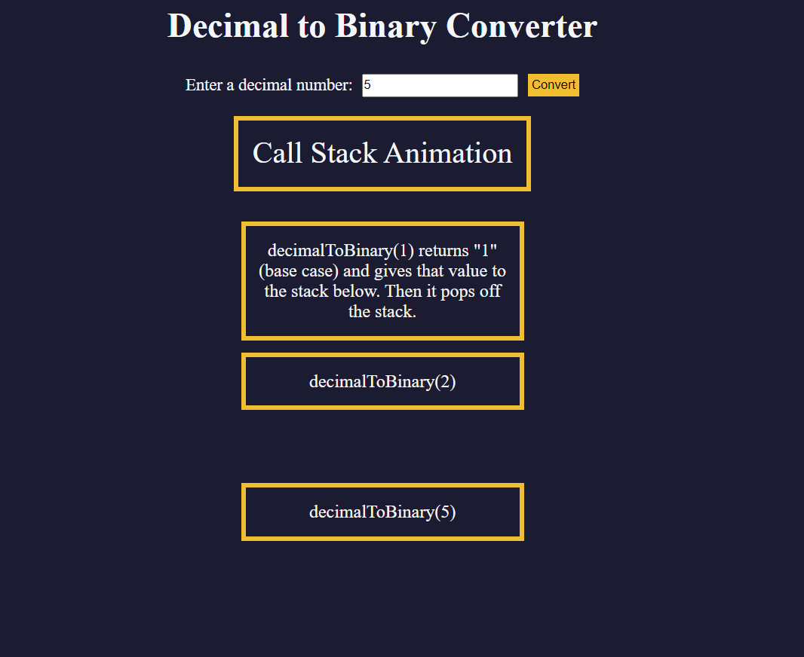

# Decimal-to-Binary-Converter [Website Link](https://kumarshivam04203.github.io/Decimal-to-Binary-Converter/)

# Project Description
   * Desimal number to convert Binary number
   * In this project, you’ll build a decimal-to-binary converter using JavaScript. You’ll learn the fundamental concepts of recursion, explore the call stack, and build out a visual representation of the recursion process through an animation.
